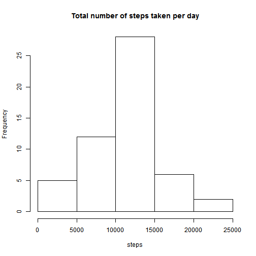
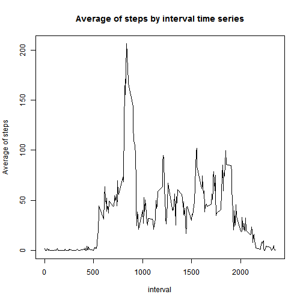
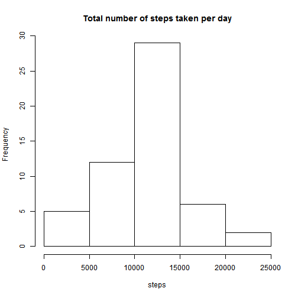
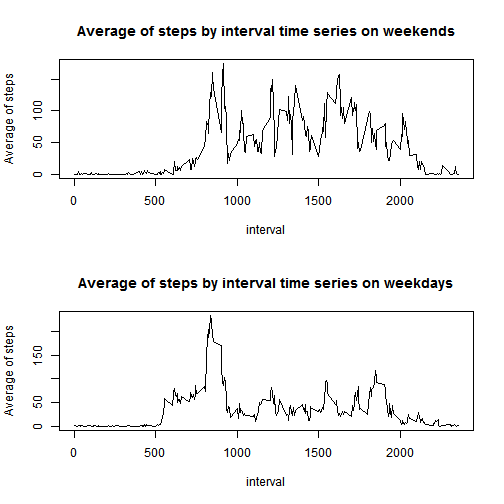

For this assessment we will be using data from a personal activity monitoring device. This device collects data at 5 minute intervals throught out the day. The data consists of two months of data from an anonymous individual collected during the months of October and November, 2012 and include the number of steps taken in 5 minute intervals each day.

The data set can be downloaded here: [Activity monitoring data](https://d396qusza40orc.cloudfront.net/repdata%2Fdata%2Factivity.zip)

### Loading and preprocessing the data

So, let's get started by loading the data set and taking a look at it.


```r
data <- read.csv("activity.csv")
nrow(data)
```

```
## [1] 17568
```

```r
head(data)
```

```
##   steps       date interval
## 1    NA 2012-10-01        0
## 2    NA 2012-10-01        5
## 3    NA 2012-10-01       10
## 4    NA 2012-10-01       15
## 5    NA 2012-10-01       20
## 6    NA 2012-10-01       25
```

So, now that we confirmed that we loaded the data correctly, let's start the assingment by doing some simple preprocessing.


### What is mean total number of steps taken per day?

First, let's calculate the total number of steps taken per day.


```r
totalperday <- aggregate(steps ~ date, data = data, sum, na.rm = TRUE)
head(totalperday)
```

```
##         date steps
## 1 2012-10-02   126
## 2 2012-10-03 11352
## 3 2012-10-04 12116
## 4 2012-10-05 13294
## 5 2012-10-06 15420
## 6 2012-10-07 11015
```

Now, let's see the totals per day using a histogram.


```r
hist(totalperday$steps, main = "Total number of steps taken per day", xlab = "steps")
```

 

Finally, let's compute the mean and median of the total number of steps taken per day.


```r
mean(totalperday$steps)
```

```
## [1] 10766.19
```

```r
median(totalperday$steps)
```

```
## [1] 10765
```

### What is the average daily activity pattern?


```r
avg_interval <- tapply(data$steps, data$interval, mean, na.rm = TRUE)
```

Now, let's see the plot


```r
plot(row.names(avg_interval), avg_interval, type = "l", main = "Average of steps by interval time series", xlab = "interval", ylab = "Average of steps")
```

 

Which 5-minute interval, on average across all the days in the dataset, contains the maximum number of steps?


```r
avg_interval[avg_interval == max(avg_interval)]
```

```
##      835 
## 206.1698
```

## Inputting missing values

There are a number of days/intervals where there are missing values. The presence of missing days may introduce bias into some calculations or summaries of the data.


```r
qtd_na <- nrow(data[is.na(data$steps),])
```
There are 2304 rows with missing values.

Our strategy to fill the missing values will be by using the mean for that 5-minute interval. In order to do that, we will iterate on the data looking for missing values and changing the rows with missing values on a copy dataset. Below we can see the code for that and the first rows of the new dataset.


```r
library(data.table)
```

```
## data.table 1.9.4  For help type: ?data.table
## *** NB: by=.EACHI is now explicit. See README to restore previous behaviour.
```

```r
new_data <- copy(data)
for (i in 1:nrow(data)) {
    if (is.na(data[i, "steps"])) {
        new_data[i, "steps"] <- avg_interval[i]
    }
}
head(new_data)
```

```
##       steps       date interval
## 1 1.7169811 2012-10-01        0
## 2 0.3396226 2012-10-01        5
## 3 0.1320755 2012-10-01       10
## 4 0.1509434 2012-10-01       15
## 5 0.0754717 2012-10-01       20
## 6 2.0943396 2012-10-01       25
```

So, let's now compare the histogram and also the mean and median of the new dataset, whithout missing values.


```r
newtotalperday <- aggregate(steps ~ date, data = new_data, sum, na.rm = TRUE)
hist(newtotalperday$steps, main = "Total number of steps taken per day", xlab = "steps")
```

 


```r
mean(newtotalperday$steps)
```

```
## [1] 10766.19
```

```r
median(newtotalperday$steps)
```

```
## [1] 10765.59
```

## Are there differences in activity patterns between weekdays and weekends?


```r
wday <- weekdays(as.Date(new_data$date), abbreviate = TRUE)
level <- vector()
for (i in 1:nrow(new_data)) {
    if ((wday[i] == "dom") || (wday[i] == "sáb")) {
        level[i] <- "Weekend"
    } else {
        level[i] <- "Weekday"
    }
}
new_data$wday <- factor(level)
```


```r
data_weekend <- new_data[new_data$wday == "Weekend", ]
data_weekday <- new_data[new_data$wday == "Weekday", ]
avg_wend <- tapply(data_weekend$steps, data_weekend$interval, mean, na.rm = TRUE)
avg_wday <- tapply(data_weekday$steps, data_weekday$interval, mean, na.rm = TRUE)
par(mfrow=c(2,1))
plot(row.names(avg_wend), avg_wend, type = "l", main = "Average of steps by interval time series on weekends", xlab = "interval", ylab = "Average of steps")
plot(row.names(avg_wday), avg_wday, type = "l", main = "Average of steps by interval time series on weekdays", xlab = "interval", ylab = "Average of steps")
```

 
